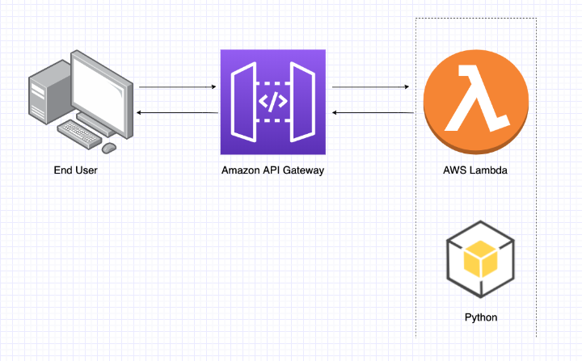

<div align="center">
<h1>AWS serverless lambda Image Model Deployment</h1>
   <div align="center">
    
  </div>
</div>

## Installation steps

1. Install awscli from [here](https://docs.aws.amazon.com/cli/latest/userguide/getting-started-install.html) and Serverless framework from below command
```
npm install -g serverless
```

2. Clone the Repo and install the requirements

```
git clone https://github.com/saadhaxxan/AWS-Lambda-Model-Deployment.git
cd AWS-Lambda-Model-Deployment
npm install
pip install -r requirements.txt
```
2. Configure AWS CLI and serverless.yml file with your credentials (provided by AWS)
```
aws configure
serverless config credentials --provider aws --key youraccesskey --secret yoursecretkey
```
3. Replace profile in serverless.yml with your profile and edit the code in src/handler.py file if you need any logic change

4. Deploy the app 
```
serverless deploy
```

## Author
You can get in touch with me on my LinkedIn Profile:

#### Saad Hassan
[](https://www.linkedin.com/in/saadhaxxan)

You can also follow my GitHub Profile to stay updated about my latest projects: [](https://github.com/saadhaxxan)

If you liked the repo then kindly support it by giving it a star ⭐!

## Contributions Welcome
[](#)

If you find any bug in the code or have any improvements in mind then feel free to generate a pull request.
